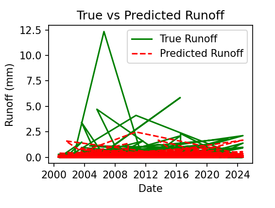
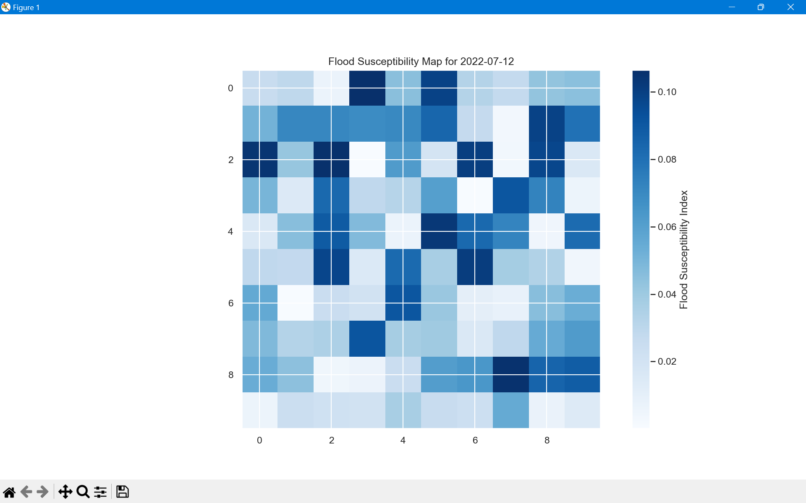
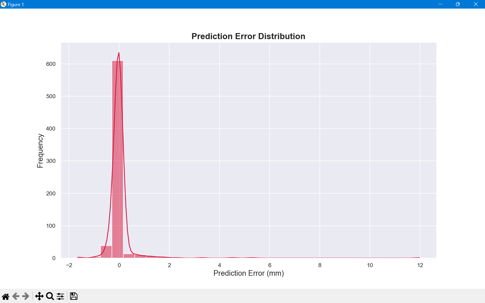
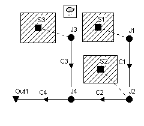

# [Urban Flood Prediction Model](./prediction.py)

This project presents an **Urban Flood Prediction Model** designed to assess and predict flood susceptibility in urban area Gurugram. Using a combination of machine learning and hydrological modeling, the project aims to provide actionable insights for urban flood risk management.This project predicts flood susceptibility by forecasting runoff values using a **Random Forest Regression model** and time-series forecasting for features. It combines **machine learning** and **time-series analysis** to provide actionable insights into flood risks.

## Features

- Predicts runoff values for future dates based on past data.
- Uses **ARIMA** for time-series forecasting of independent features.
- Implements **Random Forest Regression** for runoff prediction.
- Visualizations include:
  - Predicted vs. True Runoff Comparison.
  - Feature Importance Analysis.
  - Prediction Error Distribution.
- Flood susceptibility levels categorized into: Low, Moderate, High, and Very High.
- Handles missing data with forward-fill and mean imputation.

## Table of Contents
1. [Introduction](#introduction)
2. [Objective](#objective)
3. [Project workflow](#project-work-flow)
4. [Data Description and Preprocessing](#data-description-and-preprocessing)
5. [Model Selection](#model-selection)
6. [Model Training and Evaluation](#model-training-and-evaluation)
7. [Prediction and Visualization](#prediction-and-visualization)
8. [Integration with SWMM](#integration-with-swmm)
9. [Results and Evaluation](#results-and-evaluation)
10. [References](#references)
11. [Conclusion](#conclusion)

---

## Introduction

Flooding in urban areas like Gurugram poses challenges due to rapid urbanization and inadequate drainage systems. This project employs:
- A **Random Forest Regression** for deep learning-based predictions.
- **Storm Water Management Model (SWMM)** for hydrological simulations.

### Image: Gurugram Study Area

### Gurugram: Sector map

---

## Objective

This project aims to:
1. Predict runoff levels using machine learning.
2. Analyze meteorological impacts on urban flooding.
3. Forecast environmental variables like precipitation.
4. Simulate flood scenarios with SWMM.
5. Provide insights for urban planning and flood mitigation.

---

## Project Work Flow : 
[](https://mermaid-js.github.io/mermaid-live-editor/edit#pako:eNo9kU9uqzAQh68y8ppcIIsnpQWaSI1UQdRFoYt5MBCrxkZju39e1Uu9I_RkHRxSFoDx9_1mxnyqzvWktmow7q07Iwe4r1oLcu2ae4c95BjQU4ANFO8dGSi1oWfYbP7ATfPANLPryPuECbNH2xuCo_Ze2xEe0UTyz5fAm2TdNvVsdLgKJWGITB5EhBPySGHFbxOeN3WHkvjLvelwhjoIjtynPV6FPAlFc2LUFioh3ASlEylARaM8vWM4yrxmNYpklM1JT7SpibXkL0KHPiztp1q76nDcrUKZhLtl8F53Acq4NAVVtG4YVuYuMfumeJXhMdClIjwQD44ntB3J2Me6yKC63L__r-Y-mYfmUfuIRv-TYPLRBC_CpQSshbWz2fVI4DDNjsMSnEHBLDPm2gfWf-PCrdmHlL1rrcrURNKH7uWvfy6brQpnmqhVW3mVU31pVWu_hMMYXP1hO7UNHClT7OJ4VtsBjZdVnHuZLtc4Mk6_X2e0T85d118_iT7GwQ)

1. **Data Loading**: Load and preprocess the flood susceptibility dataset.
2. **Feature Engineering**: Handle missing data and scale features.
3. **Model Training**: Train a Random Forest Regressor on the preprocessed dataset.
4. **Time-Series Forecasting**: Use ARIMA to forecast future feature values.
5. **Runoff Prediction**: Use the trained model to predict runoff for a future date.
6. **Visualization**: Display insights through various plots.

## Data Description and Preprocessing

### [Dataset Overview:](flood_susceptibility_data_gurugram.xlsx)
The dataset spans daily climate variables from 2000-2024, focusing on:
- Wind Speed
- Temperature
- Humidity
- Precipitation
- Surface Pressure
- Runoff

### Preprocessing Steps:
1. Date parsing and indexing.
2. Handling missing values.
3. Scaling features using `StandardScaler`.
4. Splitting data into training (70%) and testing (30%).

---

## Model Selection

1. **Random Forest Regressor**:
   - Handles non-linear relationships effectively.
   - Reduces overfitting through ensemble methods.
2. **ARIMA Model**:
   - For time-series forecasting of environmental features.

---

## Model Training and Evaluation

### Training:
- Random Forest model trained with hyperparameter tuning.
- ARIMA used to forecast features like precipitation.

### Evaluation Metrics:
- **Mean Squared Error (MSE)**
- **Root Mean Squared Error (RMSE)**
- **R-squared (R²)**

---

## Prediction and Visualization

## Visualizations:
### Predicted vs. True Runoff

### Flood Susceptibility Map

### Prediction Error Distribution

---

## Integration with SWMM

The SWMM simulation complements the machine learning model by providing a hydrological perspective:
1. Sub-catchment design and infiltration modeling.
2. Hydraulic design using Manning’s formula.

### SWMM Model Example

### Gurugram Sector Map

---

## Results and Evaluation

1. **Node Flooding Analysis**:
   - Identifies hotspots for localized flooding.
   - Highlights critical zones requiring infrastructure upgrades.

2. **Sub-Catchment Runoff**:
   - Demonstrates urbanization's impact on increased runoff.

### Node Flooding Output

---

### Water Elevation Model 

## Conclusion

This project integrates **machine learning** with **hydrological modeling** for comprehensive flood risk assessment in Gurugram. The findings provide valuable insights for urban planners, policymakers, and environmental agencies.

---
## References

- A Deep Learning Framework for Daily Runoff Prediction (MDPI)
- Flood Risk Assessment and Management Using Predictive Models (ResearchGate)
- Towards Urban Flood Susceptibility Mapping Using Machine and Deep Learning Models

---
